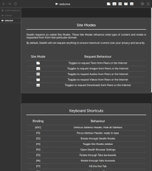
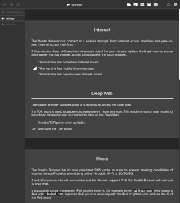
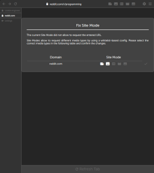
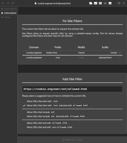
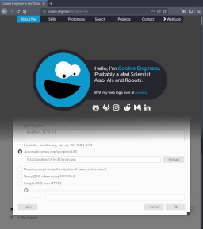

# Stealth - Secure, Peer-to-Peer, Private and Automateable Web Browser/Scraper/Proxy

Stealth is a different kind of Web Browser that aims to achieve increased privacy, increased
automation, intelligent understanding of the web and efficient bandwidth usage, no matter the
cost.

It is built by a former contributor to both Chromium and Firefox, and is built out of personal
opinion on how Web Browsers should try to understand the Semantic Web.

Stealth empowers its Users, not Website Developers that could (,will ,and did) abuse technologies
to compromise the freedom or rights of Web Browser End-Users.

Stealth also focusses on Privacy in the sense of "Real Privacy" that does not trust any website
or any URL by default. Everything has to be whitelisted by either `Site Modes` or `Site Filters`
and `Site Optimizers` whereas the latter two allow auditing the design, content and media of
regularly visited websites in an automated manner.


## Downloads / Releases

Stealth is currently in the Prototype Stage. Non-Developing Users won't enjoy it much, as things
are quite buggy and incomplete for the moment.

However, due to the concept of using node.js and focussing on a privacy-oriented audience,
Stealth will initially be released for `MacOS` and `GNU/Linux`.

Network behaviour on `Windows` cannot be guaranteed, really, so it is recommended to install
`Stealth` on an external `GNU/Linux` system (like a Raspberry Pi for a few bucks) and use Stealth
as a Web App or Stealth as a Web Proxy.

(Download Links will be inserted here once the Stealth Releases are ready for the public)


## Screenshots

Detailed Screenshots are in the [/guide/screenshots](./guide/screenshots) folder.

  

  


## Features

Stealth is both a Web Scraper, Web Service and Web Proxy that can serve its own
User Interface ("Browser UI") which is implemented using Web Technologies.

- It is secure by default, without compromise. It only supports `DNS via HTTPS`,
  and uses explicitely `https://` first, and fallsback to `http://` only when
  necessary and only when the website was not MITM-ed.

- It offers intelligent wizards on errors that help fix it. A DNS host cache
  wizard, a web archive download assistant, or a web site mode configuration
  assistant will help the user to automate everything based on rules, not based
  on situations.

- It is peer-to-peer and always uses the most efficient way to share resources
  and to reduce bandwidth, which means downloaded websites are readable even
  when being completely offline.

- It uses blacklist-based `Blockers` that is on feature-parity with AdBlock Plus,
  AdGuard, Pi-Hole, uBlock Origin and uMatrix (in the sense of "all of the above").

- It uses `Optimizers` to render only the good parts of HTML and CSS. These Optimizers
  make sure that no Client or Peer ever receives any malicious or unwanted content,
  and it is written on-filesystem-cache (which is shared later to other peers) to
  ensure that particularly. All Optimizers are applied across all `Site Modes`, and
  the `Site Modes` decide what content or media is included.

- It uses whitelist-based `Site Modes` that decide what to load, with incrementally
  allowed features (or media types). By default, Stealth will load nothing. The Site
  Mode next to the address bar decides what is loaded.

- It uses whitelist-based `Site Filters` that decide based on `prefix`, `midfix` or
  `suffix` rules what specific URL is allowed to load. This allows customization of
  regularly visited websites that are not trustworthy (e.g. allows to disable a chat
  feature, or to disable unnecessary CSS and media content).

- It uses whitelist-based `Site Optimizers` that allow DOM/HTML elements on a website
  using selectors and queries. This allows to view and download a news website article,
  modifying it automatically in a "Reader Mode" similar presentation, and delivering
  the same to all connected Clients or Peers (including Smartphones and Tablets).

- It never requests anything unnecessary. The cache is persistent until the user tells
  it to refresh the Site manually (or a scheduled Download task runs for that URL).

- It uses trust-based `Peers` to share the local cache. Peers can receive, interchange,
  and synchronize their downloaded media. This is especially helpful in rural areas,
  where internet bandwidth is sparse; and redundant downloads can be saved. Just bookmark
  Stealh as a Web App on your Android and you have direct access to your downloaded
  wikis, yay!

- It can double-function as a Content-Auditing and Content-Filtering Web Proxy inside
  other Web Browsers, which allows corporate-like setups with a shared peer-to-peer
  Cache and a local Web Archive of the Internet.

- It has intelligent error handling. In case a website is not available anymore, the
  `stealth:fix-request` error page allows to download websites automagically from trusted
  Peers or from the [Web Archive](https://web.archive.org).

- This ain't your Mama's Web Browser. It completely disables to load ECMAScript in order
  to improve Privacy. Stealth also does not support Web Forms or any Web API that could
  potentially send data to the website.

- Stealth also can be scripted as a Web Scraper inside `node.js`. The [Browser](./browser/source)
  is completely free-of-DOM, so every single task and interaction that the [Browser UI](./browser/design)
  does can be implemented in an automateable and programmable manner, even remotely through
  trusted Peers using Stealth's peer-to-peer network services.


## Stealth Guide (for Hackers?)

- [Intro](./guide/README.md)
- [Site Modes](./guide/concept/Modes.md)
- [Service API](./guide/services/README.md)
- [Usage as Web Proxy](./guide/usage/Web-Proxy.md)

Peer-to-Peer Services:

- [Cache](./guide/services/Cache.md)
- [Filter](./guide/services/Filter.md)
- [Host](./guide/services/Host.md)
- [Mode](./guide/services/Mode.md)
- [Peer](./guide/services/Peer.md)
- [Settings](./guide/services/Settings.md)
- [Stash](./guide/services/Stash.md)


## Quickstart

If you don't wanna deal with the native build toolchain, this
is how to get started as quickly as possible:


[Browser](/browser/source), the [Browser UI](/browser/design)
and [Stealth](/stealth/source) are implemented using ECMAScript Modules (`.mjs`) in order
to `export` and `import` code. This means that a modern ECMAScript Runtime like `node.js 10+`,
`Firefox 65+` or `Chromium 70+` is necessary to execute the code.


## Stealth as Web Browser

- Install same dependencies as in "Stealth as Web App" (for now).

Currently this repository does not contain a Web Browser Engine. At a later point in time
it will be decided whether a hard-fork of another Engine (like `servo` or `blink` / `webkit`)
is necessary.

For now, use Stealth as a Web App that uses one of many natively available Web View
based technologies.


## Stealth as Web App

- Install [node.js](https://nodejs.org/en/download) version `10+`.

- Install [Ungoogled Chromium](https://github.com/Eloston/ungoogled-chromium/releases) version `70+`.
- Alternatively Install [Firefox](https://www.mozilla.org/en-US/firefox) version `65+`.
- (Only MacOS) Alternatively Install `Safari` version `12+`.
- (Only Linux) Alternatively Install `electron` version `3+`.
- (Only Linux) Alternatively Install `gjs` and `WebKit2 GTK` version `4+`.
- (Only Linux) Alternatively Install `qmlscene` and `Qt5 WebView` version `5+` and `Qt5 QuickControls` version `2+`.

Stealth can be used via `<iframe>` or `<webview>` element inside a modern Browser Engine
or can be used as a Progressive Web App. The [browser.sh](./bin/browser.sh) supports most
commonly preinstalled Web Browsers among Desktop Environments (that need to be up-to-date
and support `ESM` modules).

```bash
cd /path/to/stealth;
bash ./bin/stealth.sh;

# Open as Progressive Web App
bash ./bin/browser.sh;
```

**IMPORTANT**: On Android, Stealth can be used by visiting the URL and bookmarking it as
a Web App. The Stealth Icon will appear on your home screen, and it will behave like a
native Mobile App.


## Stealth as Web Proxy

- Install [node.js](https://nodejs.org/en/download) version `10+`.
- Install [Firefox](https://www.mozilla.org/en-US/firefox) version `65+`.

Stealth can be used as a Web Proxy in `Firefox` or other Browsers that allow using an
HTTP Proxy for all network protocols by using the `Proxy Auto-Configuration` format.

Further configuration instructions and how to configure Stealth via Bookmarklets are
written down in the [Stealth as Web Proxy](./guide/usage/Web-Proxy.md) document.

```bash
cd /path/to/stealth;
bash ./bin/stealth.sh;

# Open Firefox
mkdir /tmp/stealth;
firefox -profile /tmp/stealth -new-instance -no-remote "http://localhost:65432/browser/index.html";
```


## Roadmap

### X0 (Q2 2019) - Prototype

**Browser Internals**

- [ ] Figure out whether or not `insert()` and `insert_data()` need `data-map` integration.

**Session**

- [ ] Implement `stealth/source/server/Session.mjs` service that is used for the sidebar.
- [ ] Implement `stealth/source/client/Session.mjs` (and add it to the `./bin/*.sh` files).
- [ ] Implement `pause` button event handling that should kill all requests that are part of
      the same Tab in the same Session.

**UI**

- [ ] Implement Beacon Sidebar (a Dummy View, as it is released with X1).
- [ ] Implement Peer Sidebar.
- [ ] Implement Site Sidebar.
- [ ] `stealth:fix-request` Page (Download Assistant for Peers and the Web Archive).

**Settings**

- [ ] Make `Peers` searchable (with same behaviour as with hosts).
- [ ] Make `Sites` searchable (with same behaviour as with hosts).

**Other**

- [ ] Implement `browser.download(url)` method (that schedules Requests via `Client`).
- [ ] Implement and document `Peer.proxy()` API.
- [ ] Optimizer for HTML files.
- [ ] Optimizer for CSS files.
- [ ] Re-Generate Vendor Profile.
- [ ] Clarify whether Win10 crypt32.dll supports `TLS_Method` or really only `SSLv3`.

### X1 (no date) - Optimizers

- [ ] `Content-Disposition` header support for dynamically generated downloads (e.g. `download.php?id=1337`).
- [ ] `Content-Location` header support for redirects.
- [ ] `stealth:search` Page (Search Assistant for in-offline-cache, searx.me and wiby.me).
- [ ] `stealth:cache` Page (Cache Assistant to clear, remove, update cache).
- [ ] `Site Optimizers` to allow selecting DOM/HTML via whitelist-based selectors.
- [ ] `Image Optimizers` to compress images on-disk-cache (`optipng`, `libjpeg-turbo`, `convert` from `bmp` to `jpeg`).
- [ ] `Video Optimizers` to compress videos on-disk-cache (convert to `mp4` or `mkv`).

### X2 (no date) - Adapters

- [ ] `stealth:media` Media Player for easier media playback (image, audio, video).
- [ ] Site Adapters to allow automatic URL fetches and rewrites.
- [ ] Site Scrapers to allow scheduled downloads and requests.

### X4 (no date) - Browser Engine

- [ ] Decide on a Web Browser Engine, fork it and reduce its featureset to remove non-essential features (like `WebRTC`, `Web Forms` etc.).


## License

### Private Usage

Private Usage of [Stealth](/stealth), including its [Browser](/browser/source) and
[Browser UI](/browser/design) is licensed under [GNU GPL 3](./LICENSE_GPL3.txt).

### Commercial Usage

Commercial Usage is meant for Businesses and Companies that use Stealth for Web Automation,
Web Scraping, Web Filtering or Web Intelligence purposes.

A Commercial License will be available for purchase once Stealth reaches the `X0`
milestone and is released to the public.

For the time being, assume `All Rights Reserved` and `(c) 2019-* Cookie Engineer` for Commercial Usage.

